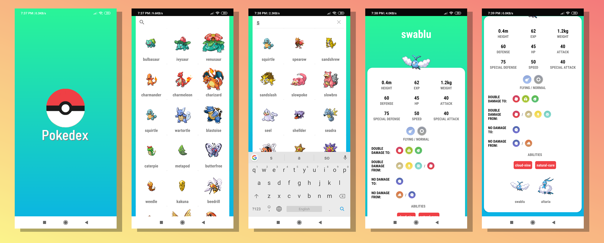

<p align="center">
  
  
  
</p>
<p align="center">
  
</p>

> Mobile mini guide application for Pokemon games players.

## Table of contents
* [Introduction](#introduction)
* [Features](#features)
* [Technologies](#technologies)
* [Screenshots](#screenshots)
* [Setup](#setup)
* [License](#license)

## Introduction
**Pokedex** is an android mobile application which is kind of a **guide with useful informations** for **Pokemon** games players.
</br></br>
It allows to obtain a **knowledge** about huge **list of pokemons**, their *statistics*, *evolutions* and more!
</br></br>
Nowadays, **one of the most popular mobile games is Pokemon GO** for which Pokedex is **very useful** and makes gameplay **more convenience**.
</br></br>
You can **search for your favourite Pokemon**, get to know about its *average height*, *attack power* or for which pokemon types *deals double damage*.
</br></br>
**Design** is a little **inspired by** this from *Pokemon GO* game, which is **minimalistic** and **user-friendly**.
</br></br>
For the proper operation of an application, **internet connection is required**.
</br></br>
Pokedex is made for **smartphone** with **Android 5.0+** system but **targeted version** is **Android 9.0** on which application **was tested**.
</br></br>

*An application uses the RESTful Pokemon API -> [PokéAPI](https://pokeapi.co/) .*

*Project was made for my own use and convenience with Pokemon GO game.*

## Features
* Access to huge list of Pokemons
* Search engine by pokemon name
* Informations about appearance, statistics, abilities, evolutions and types
* Specified attack powers to various types
* Quick access to searched informations
* Useful with pokemon games
* Makes Pokemon GO fights easier :fire: :zap: :snowflake:

## Technologies
* Android Studio 3.4.1 or newer
* Android Emulator or Android device (highly recommended)
* Android 5.0, but more targeted 9.0
* RESTful API [PokéAPI](https://pokeapi.co/)
* Internet connection required

## Screenshots
<p align="center">
	
</p>

## Setup
* [Install Android Studio](https://developer.android.com/studio)
* Clone repository
```
git clone https://github.com/mroui/pokedex.git
```
* Import project by Android Studio
* Run with emulator or android device connected via usb 

## License
This project is licensed under the terms of the MIT license.